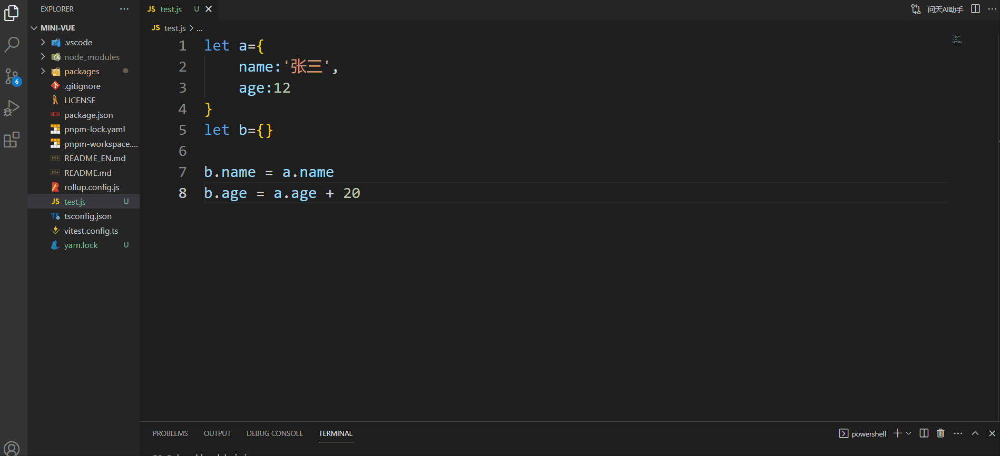

# 问天AI助手




这是一个 VS Code 小插件,用来快速优化代码,基于chatgpt的,当然也可以在插件里面,直接提问,得到chatgpt的答案。

## 1、VS Code 里面安装插件

在插件商店直接搜索“问天AI助手”安装即可


## 2、如何让运行调试

```
yarn 安装依赖后，直接点击VS Code 上的 Run --> Start Debugging

```

## 3、chatgpt

国内用户可以直接访问网页版 https://www.h3d.cc 